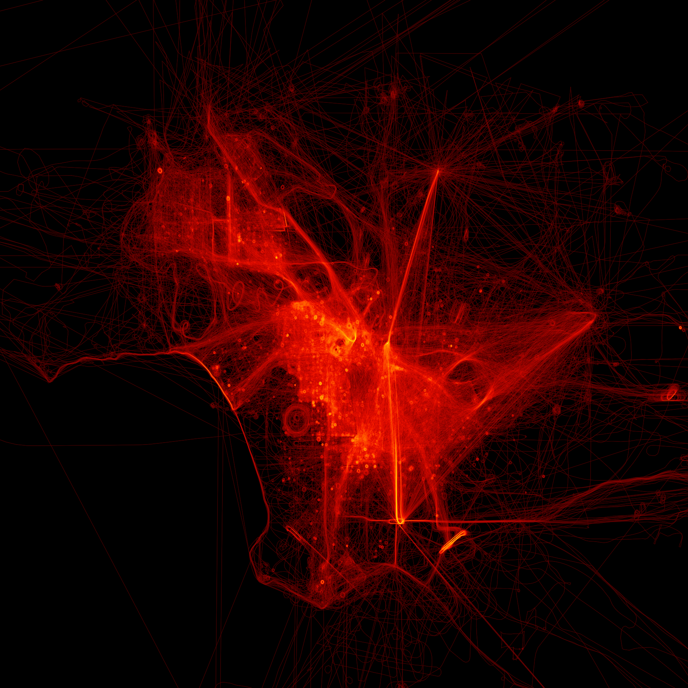

# LE Birds of LA

This project uses data from [The OpenSky Network](https://opensky-network.org) to plot law enforcement helicopter activity over Los Angeles County.



Currently only known LAPD and LASD helicopters are plotted (i.e. other agencies or non-LE activity is not included).

## Setup

Recommended to use virtualenv

```
$ source bin/activate
```

Install dependencies

```
$ pip install
```

## Data Acquisition & Preparation

Download all open CSVs available from OpenSky. This will extract only the CSV from the original tarfile.

```
$ python data.py download_all
```

Convert the entire dataset to Parquet for faster processing later. This won't delete the original CSVs, so delete them manually if disk space is of concern.

```
$ python data.py repack_all
```

Filter the dataset to include only state vectors for the aircraft we care about, as defined in le_birds.csv

```
$ python data.py process
```

## Plotting

Check out [`le_birds.ipynb`](le_birds.ipynb) to see the plotting code.

## Credits

Flight history data is provided and copyright by [The OpenSky Network](https://opensky-network.org). This project is currently limited to the publicly available data [here](https://opensky-network.org/datasets/states/). In the future I hope to get access to the full dataset!

Shoutout to Dask, Datashader, and Pandas for making this so easy and efficient.
